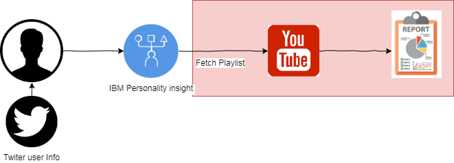

Project Idea:
--------------------------------------------------
Flow:
1. The user profile from twitter is extracted and given as a input to personality insight to analyse.
2. as per traits, on the basis of likelyness we need to fetch the playlist from youtube
3. return back the playlist to user.

Setup steps:-
1. Python 2.7 must be installed, python --version
2. PIP must be installed
3. Flask must be installed, pip install Flask
4. Extract the project code
5. run following command:-
pip install --upgrade google-api-python-client python-gflags oauth2client==1.4.12 google-auth google-auth-oauthlib google-auth-httplib2

6.run FLASK_APP=index.py flask run
7. Add client-secret.json
8. In index.py, add your API key

Project keys configuration:-
1. Goto https://console.cloud.google.com/home/dashboard & signup using your google account
2. click on my project
4. A project will be created and opened
5. Go to API & service page > credentials
6. You need to create a API and OAuth2.0 Id
7. first generate api key
8. For Oauth > select other and download client-secret.json

API Reference:-

1. localhost:5000/getPreferenceMusic - Get Videos as per genre's (Preferences JSON, only score > 0 )
2. localhost:5000/createPlaylistFromPreferences (Fetch videos as per genre's and create a playlist and add those fetched videos into playlist)
3. localhost:5000/getMyPreferencePlaylist -  Get list of Playlist of user with matching genre's from Preferences JSON with score > 0 
4. localhost:5000/deleteMyPreferencePlaylist - Delete Preference Playlist

